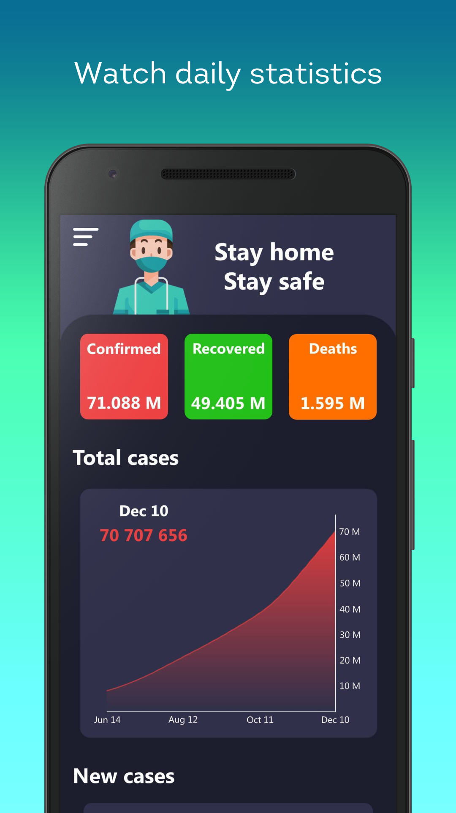
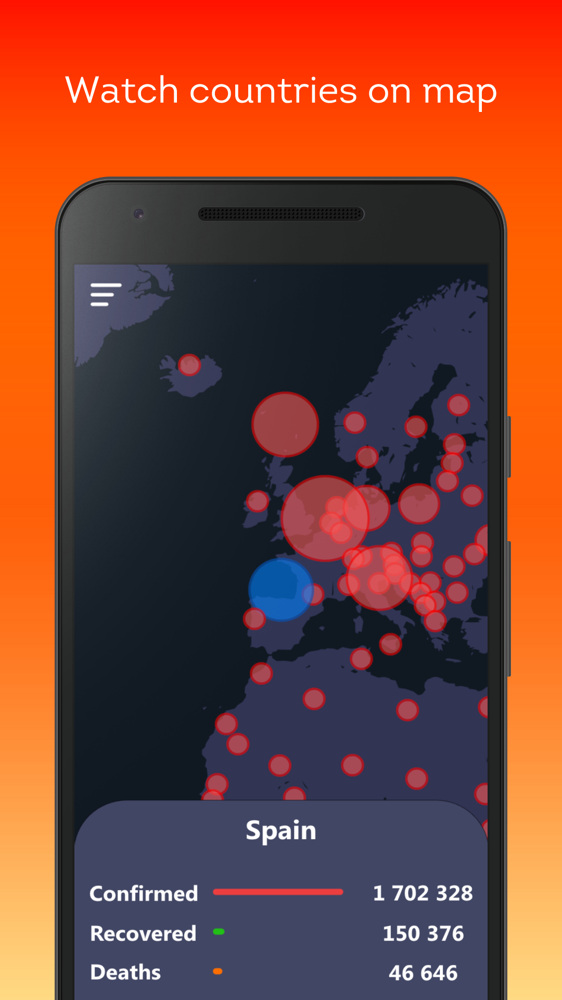
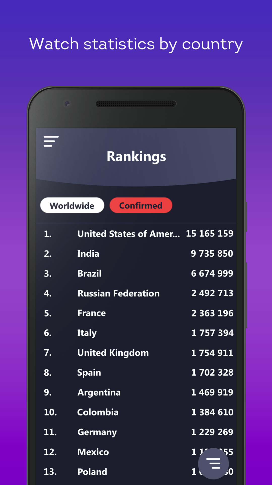
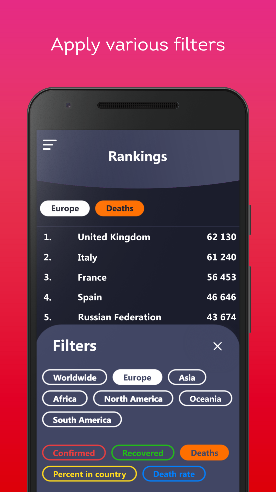

# Coronka

### Coronavirus statistics app

#### Screenshots

  
   
  
   
  

#### Technology stack:
- Kotlin
- MVVM
- Google maps
- RxJava 2
- New York Times Api

#### Main features:
- [x] Daily statistics
- [x] News screen
- [x] Tips screen
- [x] Statistics by country
- [x] Advanced countries filtering
- [x] Countries on map

#### Additional features:
- [ ] Light theme
- [ ] UI tests
